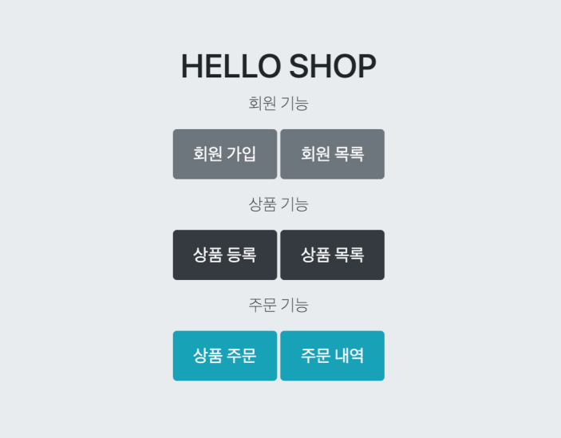
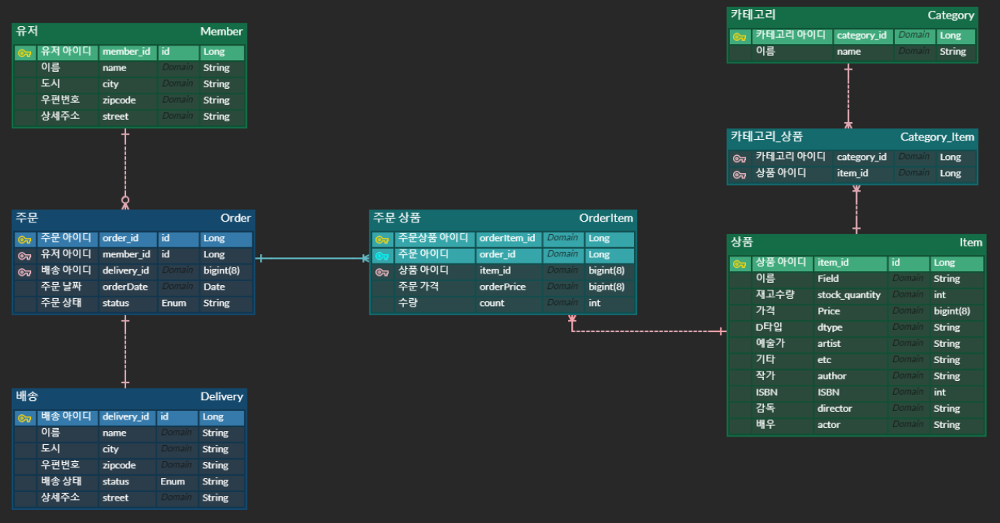

# 실전! 스프링 부트JPA 활용1



### Intro

---

해당 repository는 김영한님의 강의인 실전! 스프링 부트JPA 활용 1을 학습하고 정리한 내용이 담겨있습니다. jpa를 활용한 쇼핑몰을 만들었습니다. 쇼핑몰을 만들면서 ERD를 작성하는 방법과 JPA에서 지원하는 다양한 기능들을 직접 사용해보면서 여러가지 요구사항 해결하는 방법을 배웠습니다.

### Environment

- Spring Boot 2.7.1
- Java 11
- thymeleaf
- junit 4.13.1

### Library

- spring-boot-starter-data-jpa
- spring-boot-starter-thymeleaf
- p6spy-spring-boot-starter:1.5.6
- spring-boot-starter-web
- spring-boot-devtools
- spring-boot-starter-validateion
- junit4.13.1
- lombok
- h2
- spring-boot-starter-test

 

## Entity Relationship Diagram

---



- 상품을 보면 감독, 작가, 예술가 등등 여러 분야의 정보가 포함되어 있습니다. 그림, 책, 영화 등 여러 종류의 아이템을 고려하여 Single Table 방식으로 제작 되었습니다.
- ManyToMany(N:M) 관계가 2개정도 보입니다. 주문과 상품 그리고 상품과 카테고리가 ManyToMnay 관계입니다. ManyToMany의 관계의 경우 직접 서로 참조하는 것 보다는 중간 테이블을 두어서 oneToMany, ManyToOne으로 연결하는 것이 좋습니다. 예를 들어 주문 상품만에 필요한 컬럼이 생겨 추가적인 컬럼이 필요할 수 있고 실무에서는 @ManyToMany 어노테이션을 사용해서는 안된다.

## 소소한 팁

---

- h2 설정시 팁
    - 인메모리 방식으로 진행 시 추가적으로 h2를 설치하고 세팅할 필요 없이 디펜던시 설정만 완료되면 된다.

```
spring:
  datasource:
    url: jdbc:h2:mem:testdb
    username: sa
    password:
    driver-class-name: org.h2.Driver
```

- show_sql 옵션은 System.out에 하이버네이트 실행 SQL을 남긴다. 따라서 실제 서버에서 사용해선 안된다.
- org.hibernate.SQL 옵션은 logger를 통해 하이버네이트 실행 SQL을 남긴다.

yml에 적용시

```jsx
logging.level:
 org.hibernate.SQL: debug
```

- spring dev-tool 의존성이 부여된 경우
    - ctrl + shift + f9 단축키를 이용해 html 파일 수정을 바로 반영할 수 있다.

- yml 파일은 띄어쓰기 2칸으로 계층을 만든다.

- Entity 클래스 생성시 @Setter를 제거하고, 생성자에서 값을 모두 초기화해서 변경 불가능한 클래스를 만들어야 한다. 그리고 생성 방식은 생성자나 아니면 생성 메소드를 만들어서 진행하는 것이 좋다.
- h2 디펜던시가 설정 되어있다면 yml 파일 설정이 아예 없는 경우에도 test시 자동으로 인메모리 방식으로 진행되며 ddl 방식은 create으로 설정된다.
- 동적 쿼리는 예를들어 여러 조건 중 사용하지 않는 조건이 포함될 경우 JPQL로도 가능은 하나 queryDSL을 사용하는 것이 좋다.
- 주소에는 도시, 우편번호, 상세 주소등 큰 단위부터 작은 단위의 정보가 포함된다 이는 모두 주소라는 특징이 있으니 주소라는 클래스 내부의 변수로 우편번호, 도시를 넣으면 코드가 좀더 이해하기 쉽게 된다. 하지만 DB에는 부모 관계는 없기 때문에 이 때 @Embeddable 과 @Embedded 어노테이션을 활용할 수 있다. 주소라는 포괄하는 부모 클래스를 생성할 때는 @Embeddable을 클래스에 붙여주면 되고 사용하는 쪽(주로 Entity)에서는 @Embedded 어노테이션을 사용하면 된다.
- 상품에는 여러가지 종류의 물건이 있다 예를 들어 영화, 예술품, 책 등등이 있다고 생각해보자. 대부분의 특성은 같지만 책은 ISBN 번호가 따로 존재하고 작가, 감독, 아티스트 등 부르는 컬럼 명도 다르다. 하지만 모두 같은 상품 같은 엔티티로 보아야 주문에 주문 상품이 담긴다는 로직을 제작할 수 있다. 그리고 대부분의 변수는 종류가 다른 상품이라도 같은 상품이기 때문에 비슷한 점이 많다. 이럴 때 상속 관계를 가질 수 있고 아래와 같이 엔티티를 설정하면 된다.

상품(Item)

```
@Entity
@Inheritance(strategy = InheritanceType.SINGLE_TABLE)
@DiscriminatorColumn(name = "dtype")
@Getter
@Setter
public abstract class Item {

    @Id @GeneratedValue
    @Column(name = "item_id")
    private Long id;

    private String name;

    private int price;

    private int stockQuantity;

    @ManyToMany(mappedBy = "items")
    private List<Category> categories = new ArrayList<Category>();

    //==비즈니스 로직==//
    public void addStock(int quantity) {
        this.stockQuantity += quantity;
    }

    public void removeStock(int quantity) {

        int restStock = this.stockQuantity - quantity;
        if(restStock < 0) {
            throw new NotEnoughStockException("neeed more stock");
        }
        this.stockQuantity = restStock;
    }
}
```

영화(Movie)

```
@Entity
@DiscriminatorValue("M")
@Getter
@Setter
public class Movie extends Item{

    private String director;
    private String actor;

}

```

책(Book)

```
@Entity
@DiscriminatorValue("B")
@Getter
@Setter
public class Book extends Item {

    private String author;
    private String isbn;
}

```

- 실무에서는 @Setter를 위와 같이 마구마구 사용해선 안되고 생성 방법을 한가지로 강제하는 것이 좋다. 그럴 경우 아래와 같은 어노테이션을 만들어 사용할 수 있다.

     `@NoArgsConstructor(access = AccessLevel.*PROTECTED*)`
